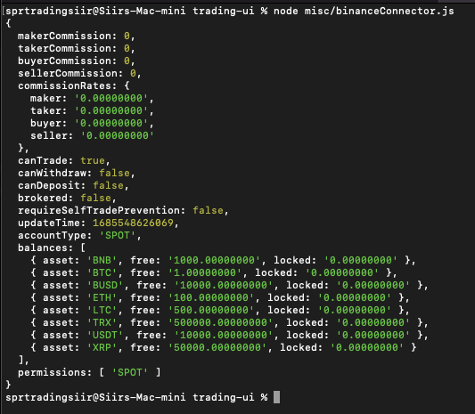
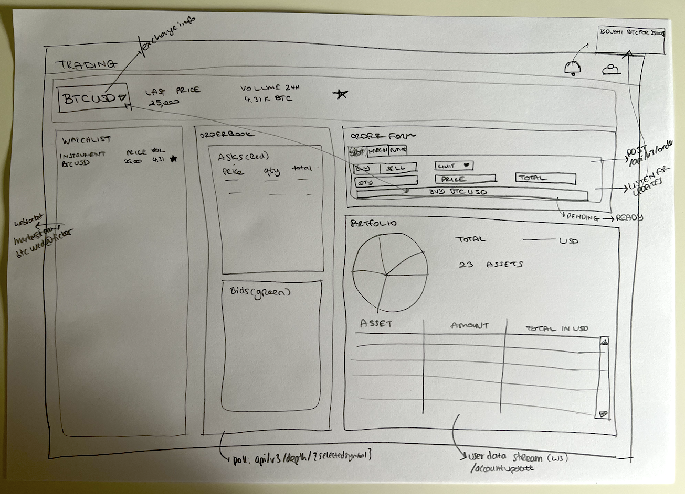

# Trading Dashboard Application

## Getting Started
Please check out the repo and run the following to install dependencies in its root

`npm install`

Once npm is done, please run the application

`npm run dev`

Above runs in dev mode but `package.json` allows building and starting the app as well.

By default the Home page will be served on root at `localhost:3000`, but the dashboard is on `localhost:3000/dashboard`

Note the version of node being used is: 18.16.0

## Task
The goal is to build a React web app that allows managing a watchlist of tickers and a simple portfolio (live). The technologies used should be: React, Redux, Binance API.

## Scope & Process
The task is quite open-ended, therefore some choices were made to complete an MVP in the given time frame.

The plan of development:
1. Read up on Binance API to understand what's feasible (apis, websockets, authentication etc.).
2. Come up with a UX design (image at the bottom)
3. Build skeleton app with Next.js, React and MaterialUI as starting libraries (using TS)
4. Build the full UI as per UX design
5. Integrate real data with websockets, REST calls, and polling.
6. Write tests
7. Deploy

Scope was a great challenge as building an entire trading app is something that takes significant time. However, there was great focus on providing as much functionality as possible in short amount of time. The final application is production level code quality, UI, and real-data integration, however there are some challanges that need to be overcome first.

Some of the limitations put on scope were:
- Responsive UI was not a primary concern, although it should not be hard to make it responsive iteratively
- Limited use of Redux as a general design choice. However, there are some async functionalities that could improve the app if added in the future (e.g. in the OrderBook).
- Binance API challenges were expected and alternative solutions were implemented.
- Order Book widget was a quick extra (but a realistic need for a trading app) and therefore it works by polling simply (instead of maintaining a local OB as suggested by Binance)
- Basic use of Next.js features (this is good as such features should be implemented iteratively and as needed in real life anyway)
- Limited tests
- Limited Linting

## Challanges
The biggest challenge was the use of the Binance API, specifically the signed (authenticated) endpoints. The code for this available in `src/utils/requests` but users will see that the Orders are not sent and Balances are not streamed because of this 401 Error issue. The signature is correct as checked against the `@binance/connector` library, but there seem to be challanges around making direct calls from the browser. This would need further investigation.

However, in a real world application, we would not have the React app connect directly to Binance for trading. It should pass via a backend service for a couple of reasons:
- Securiy (Private Key should not live on the client code)
- Rate Limits
- Simpler, lightweight and bug free UI code integration

In that regard, I was able to get it to work with Node.js using `@binance/connector`. This code is available in `misc/binanceConnector`. A Node Express app could be built to serve the above point. To run it, please use the command `node misc/binanceConnector.js` from root of project.

## UI Design

